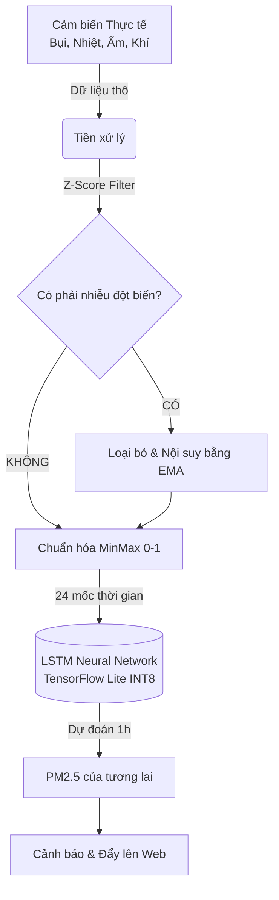
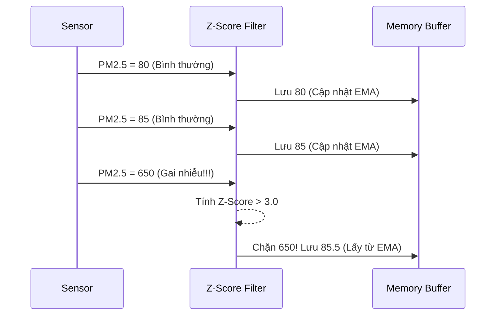
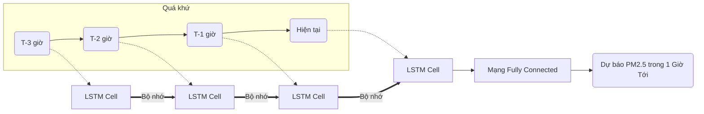

# Báo Cáo Kiến Trúc Và Thuật Toán AI
**Dự án:** Hệ thống giám sát và Dự báo chất lượng không khí (Air Quality AIoT)

---

## 1. Tổng quan Kiến trúc Edge AI (AI Tại Biên)

Hệ thống sử dụng mô hình lập trình **Edge AI** (Trí tuệ nhân tạo tại biên). Thay vì phải gửi hàng ngàn mẫu dữ liệu lên Cloud mỗi phút để tính toán (gây độ trễ và tốn băng thông), con chip **ESP32-S3** đóng vai trò như một bộ não siêu nhỏ chạy trực tiếp mô hình Mạng nơ-ron cục bộ.

---

## 2. Phát Hiện Bất Thường (Anomaly Detection)

Trong điều kiện môi trường tự nhiên, bụi mịn (PM2.5) hoặc nhiệt độ luôn thay đổi theo dạng đường cong mượt mà (Smooth Curve). Tuy nhiên, các cảm biến quang học như GP2Y/PMS7003 rất nhạy cảm với dị vật bay ngang qua, hoặc bị nhiễu do ai đó thổi khói thuốc, tạt bụi quét nhà trực tiếp vào. 

Để tránh việc AI bị "mù" bởi dữ liệu rác, hệ thống áp dụng thuật toán **Z-Score kết hợp Exponential Moving Average (EMA)**.

### Nguyên lý hoạt động
1. **Đường cơ sở (EMA):** Hệ thống liên tục tính trung bình động của môi trường để vẽ ra một "đường chuẩn".
2. **Độ lệch chuẩn (Variance):** Đo mức độ dao động bình thường của không khí.
3. **Chấm điểm Z-Score:** Khi có dữ liệu mới, tính toán xem nó lệch bao nhiêu độ lệch chuẩn so với đường EMA.
   - Nếu $Z\_Score \le 3$: Dữ liệu sạch, cho phép đi qua.
   - Nếu $Z\_Score > 3$: Đây là **Nhiễu cục bộ (Spike)**! Khóa lại và dùng đường EMA đắp vào.

---

## 3. Thuật Toán Dự Báo Chuỗi Thời Gian (LSTM)

Thuật toán chính để dự báo tương lai là **Long Short-Term Memory (LSTM)**, một biến thể nâng cao của Mạng nơ-ron hồi quy (RNN).

### Tại sao lại chọn LSTM?
Các mạng nơ-ron truyền thống (FNN) bị "mất trí nhớ", chúng chỉ nhìn vào dữ liệu của hiện tại để đoán tương lai. Điều này là vô dụng trong dự báo thời tiết.
LSTM giải quyết bằng cách duy trì một **Băng chuyền trạng thái (Cell State)**. Nó nhớ được rằng "Trong 3 giờ qua, bụi đang tăng dần, nhiệt độ đang giảm dần -> Sắp có sương mù ô nhiễm".

### Cấu trúc mô hình
Hệ thống AI được thiết kế với ma trận đầu vào `Input Shape: [1, 24, 4]`.
- **24 time-steps:** Trượt dọc trên dòng thời gian (Chứa 24 mẫu lịch sử gần nhất).
- **4 features:** PM2.5, Nhiệt độ, Độ ẩm, Áp suất.

### Kỹ thuật Tối ưu hóa: Quantization (Lượng tử hóa)
Để một mô hình Deep Learning có thể chui lọt qua lỗ kim của bộ nhớ ESP32, chúng ta áp dụng **Post-Training Quantization**:
- Biến đổi ma trận trọng số (Weights) từ số thực dấu phẩy động 32-bit (`Float32`) về số nguyên 8-bit (`INT8`).
- **Hiệu quả:**
  - Kích thước File mô hình giảm 4 lần (Từ vài MB xuống còn ~40KB).
  - Tốc độ suy luận tăng gấp bội (Vi điều khiển tính toán số nguyên nhanh hơn số thực). ESP32-S3 chỉ mất **~217 ms** cho mỗi lần suy luận.
  - Tích hợp thêm hàm **MinMaxScaler** viết bằng C++ để đồng bộ hóa dữ liệu thực tế với ngưỡng INT8 của mô hình.

---
> **Kết luận:** 
> Việc phối hợp giữa thuật toán **Bộ lọc Z-Score truyền thống** và **Trí tuệ nhân tạo LSTM hiện đại** giúp ESP32 đạt được 2 mục tiêu: "Bền bỉ với nhiễu" và "Tầm nhìn xa", trở thành một thiết bị đo kiểm thông minh vượt xa các thiết bị chỉ biết hiển thị số thụ động trên thị trường.
